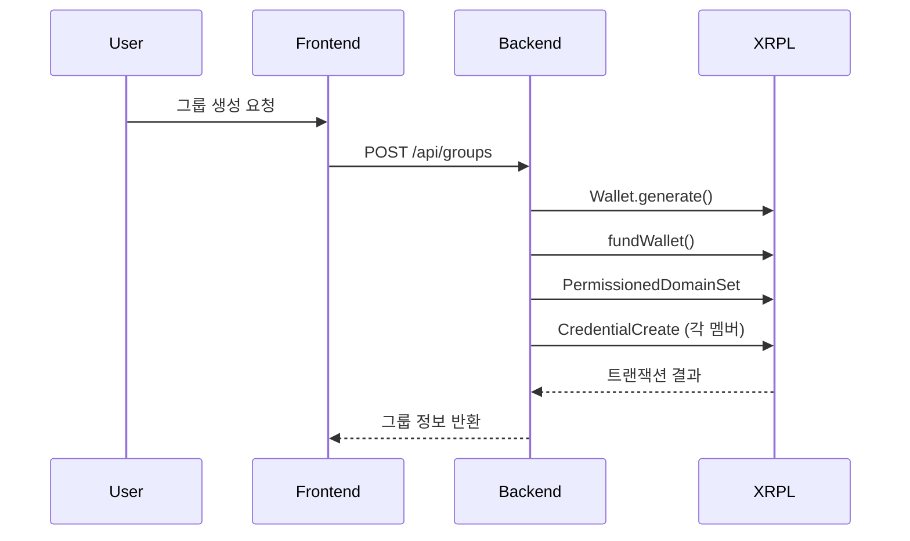
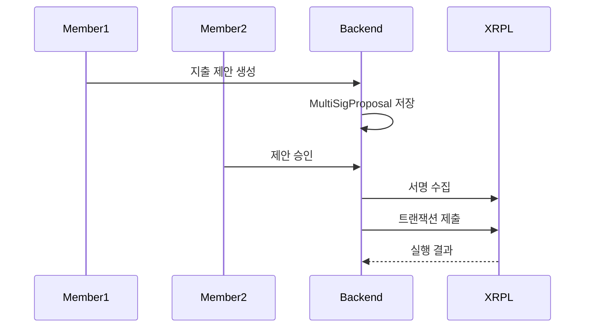

# Moim Wallet: XRPL-Based Group Wallet Management System

Moim Wallet is a comprehensive group wallet management platform built on XRP Ledger (XRPL) that enables secure, credential-based access control for shared financial accounts.

The system uses XRPL's advanced features including Credentials, Permissioned Domains, and Multi-signature transactions to create a robust group payment solution.

## 🎥 Demo Video
[](https://www.youtube.com/shorts/OwxiOluOcqY)
---

## 📱 UI ScreenShot

### 홈 화면 - 지갑 목록


### 그룹 지갑 생성


### 지갑 상세 정보


### 스테이킹


---

## 🔗 XRPL 활용 설명

### 1. **Credential 시스템**
- **목적**: 그룹 멤버십 인증 및 접근 권한 관리
- **구현**: 그룹 지갑이 멤버들에게 `GROUP_MEMBER` 타입의 Credential 발급
- **보안**: 오직 유효한 Credential을 가진 사용자만 그룹 지갑에 접근 가능

```javascript
// Credential 생성 로직
const tx = {
  TransactionType: "CredentialCreate",
  Account: issuer.address,
  Subject: memberAddress,
  CredentialType: toHex("GROUP_MEMBER"),
  Expiration: now + (8760 * 3600) // 1년
};
```

### 2. **Permissioned Domain**
- **목적**: 그룹 지갑에 대한 접근 정책 정의
- **구현**: 특정 Credential 타입만 허용하는 도메인 생성
- **효과**: 승인된 멤버만 그룹 지갑 트랜잭션에 참여 가능

```javascript
const tx = {
  TransactionType: "PermissionedDomainSet",
  Account: groupWallet.address,
  AcceptedCredentials: [{
    Credential: {
      Issuer: groupWallet.address,
      CredentialType: toHex("GROUP_MEMBER")
    }
  }]
};
```

---

## 🏗 시스템 아키텍처

### Backend (Node.js + Express)
- **XRPL 연동**: `xrpl` 라이브러리를 통한 블록체인 상호작용
- **데이터베이스**: Prisma ORM + SQLite
- **주요 서비스**:
  - `xrplCredentialService.js`: Credential 및 Permissioned Domain 관리
  - `groupService.js`: 그룹 지갑 생성 및 관리
  - `multiSignatureService.js`: 다중 서명 트랜잭션 처리

### Frontend (React + TypeScript)
- **라우팅**: React Router를 통한 SPA 구조
- **상태 관리**: React hooks 기반
- **UI 컴포넌트**: Tailwind CSS + Lucide React 아이콘

---

## 🔄 트랜잭션 플로우

### 1. 그룹 지갑 생성


### 2. 그룹 지출 승인


---

## 📊 실제 XRPL 트랜잭션 결과

### 성공한 트랜잭션들:

#### **1. Permissioned Domain 생성**
- **Transaction Hash**: `D54AEF3C062DCE76ADC8DEF73643691976E5CED612494800636548AFFAE2A859`
- **Domain ID**: `4C6BC76BD8D28A4E58B13D2AA9947BAE6F7A44E0A8D04E9A79BF178E7C1EE80E`
- **Status**: `tesSUCCESS` ✅
- **Explorer Link**: `https://testnet.xrpl.org/transactions/D54AEF3C062DCE76ADC8DEF73643691976E5CED612494800636548AFFAE2A859`

#### **2. Credential 발급 (Member 1)**
- **Transaction Hash**: `BB99F515DCFFBCD5DD912C926B2D0728BDCAFE2437DD3B1F6D74AD688217E3AD`
- **Subject**: `rw6QtQH43oZ6avqdukxKx5MG58NaGXZjLr`
- **Status**: `tesSUCCESS` ✅
- **Explorer Link**: `https://testnet.xrpl.org/transactions/BB99F515DCFFBCD5DD912C926B2D0728BDCAFE2437DD3B1F6D74AD688217E3AD`

#### **3. Credential 발급 (Member 2)**
- **Transaction Hash**: `675DC60DFEA7159E8A8D4243639C24FCA104FA801E10189BC45AC0CF22E822F0`
- **Subject**: `r4No2Fkvqd4oHeoQ3FubG5PLeRRMiHzxnS`
- **Status**: `tesSUCCESS` ✅
- **Explorer Link**: `https://testnet.xrpl.org/transactions/675DC60DFEA7159E8A8D4243639C24FCA104FA801E10189BC45AC0CF22E822F0`

---

## 🎯 오디오 데모
[](https://youtu.be/JPg5nH9LyOA)

---

## 🔧 기술 스택

### Blockchain
- **XRP Ledger**: 메인 블록체인 플랫폼
- **XRPL.js**: JavaScript SDK
- **Testnet**: 개발 및 테스트 환경

### Backend
- **Node.js**: 런타임 환경
- **Express.js**: 웹 프레임워크
- **Prisma**: ORM 및 데이터베이스 관리
- **SQLite**: 로컬 데이터베이스

### Frontend
- **React**: UI 라이브러리
- **TypeScript**: 타입 안정성
- **Tailwind CSS**: 스타일링
- **Vite**: 빌드 도구